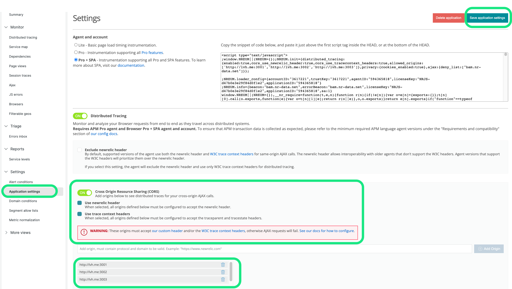

# Relicstaurants Application

> The Relicstaurants repository has been created as a microservice architecture environment so that you can test New Relic observability on a lightweight project. You can copy or fork the repository, run it locally, and implement observability yourself. 

## Requirements
In order to spin up this application locally on your device, you will need the following software:  

* A free account with [New Relic](https://newrelic.com)
* [Git](https://github.com/git-guides/install-git) - You can verify installation with `git –version`
* [Node.js & Node Package Manager (NPM)](https://docs.npmjs.com/downloading-and-installing-node-js-and-npm) - You can verify installation with `node -v` and `npm -v`
* [Docker Desktop](https://www.docker.com/products/docker-desktop/)
* [Xcode (Mac only)](https://developer.apple.com/xcode/) - You can verify installation with `xcode-select -p`
* [Make (Windows only)](https://linuxhint.com/run-makefile-windows/) - You can verify installation with `make -v`

*Note: the above verification commands should be ran in Terminal on Mac or Command Prompt on Windows*
## Installation
1. From a new Terminal or Command Prompt window, clone this repository using Git `git clone https://github.com/Bijesse/Relicstaurants-Docker`
2. Navigate into your new workspace using `cd Relicstaurants-Docker`
3. Ensure that Docker Desktop is running on your device 
4. Run `docker-compose up`
5. Visit the app at [http://localhost:3000/](http://localhost:3000/)

After successfully completing the installation process above, your new application will be running at [localhost:3000](http://localhost:3000/) 

## New Relic APM Instrumentation
This application is comprised of 3 microservices [restaurantService](restaurantService/newrelic.js), [menuService](menuService/newrelic.js), [checkoutService](checkoutService/newrelic.js). In order to monitor and observe data properly, each service will need to be instrumented with the New Relic APM agent. Let's start with restaurantService:

1. In your New Relic account, select **add data** and locate APM for [Node.js](https://one.newrelic.com/marketplace?account=3617221&duration=1800000&state=8e76f453-269a-ac05-0db9-431a2e82ad73)
2. Install the agent via **On a host (without PM2)**
3. Follow the first 5 steps provided on the "Add your Node.js application data" page. Be sure to.. `cd` into the correct directory before installing the agent, add your New Relic Ingest License key to line 16 of the `newrelic.js` file, and add `require('newrelic');` to the first line of the index.js file.
4. Repeat the 3 steps above for menuService and checkoutService.

Make several orders in the Relicstaurants app running at localhost:3000 and check the pre-built dashboards for data being observed by New Relic.

## New Relic Browser Instrumentation
The next New Relic agent to be added to this application is Browser. This will allow for you to have full stack observability and make use of the distributed tracing features of New Relic.

1. In your New Relic account, select **add data** and locate Browser for [React](https://one.newrelic.com/marketplace?account=3617221&duration=1800000&state=37da579a-b782-d2fb-6656-35acd0b868d0)
2. Select **Copy/Paste JavaScript Code**
3. Name your app as a standalone app called "frontend"
4. Click **enable**. You may ignore the HTML snippet that appears on screen for now and instead close this window. 
5. Navigate to the Browser Applications being observed in your New Relic account. You should see the service "frontend" listed there. Click on it.
6. Select "Application settings" view in the "Settings" section on the left *- see screenshot below*
7. Enable "Cross Origin Resource Sharing(CORS)", "Use newrelic header", "Use trace context headers" and add the backend origins (http://lvh.me:3001 http://lvh.me:3002 http://lvh.me:3003 ) to enable newrelic headers to be passed between the frontend app and the microservices instrumented with APM *- see screenshot below*
8. Click "Save application settings" *- see screenshot below*
9. This will redirect you to the main view of the browser app in New Relic. At this point, re-enter the "Application settings" view and copy the HTML snippet available in the first section. The snippet should be then pasted after the meta tag in the public > [index.html](public/index.html) file. 

 

After completing the steps above, generate some traffic on your application and view the data in New Relic.

## Simulate application traffic
This repository includes a simulator file that will make random orders on Relicstaurants so that you do not need to manually generate traffic. Run the simulator  script with the following steps:

1. Install [Python3](https://www.python.org/downloads/) via the Terminal or Command Prompt
2. Install Selenium and Webdriver via the Terminal or Command Prompt with `pip3 install webdriver-manager selenium`
3. Navigate into the **simulator** directory
4. run `simulator.py`

*Note: If you encounter any issues while on a Windows PC, try running this script in a administrator shell.* 

## Contributing

We encourage your contributions to improve Relicstaurants! Keep in mind when you submit your pull request, you'll need to sign the CLA via the click-through using CLA-Assistant. You only have to sign the CLA one time per project.
If you have any questions, or to execute our corporate CLA, required if your contribution is on behalf of a company, please drop us an email at opensource@newrelic.com.

### **A note about vulnerabilities**

As noted in our [security policy](../../security/policy), New Relic is committed to the privacy and security of our customers and their data. We believe that providing coordinated disclosure by security researchers and engaging with the security community are important means to achieve our security goals.

If you believe you have found a security vulnerability in this project or any of New Relic's products or websites, we welcome and greatly appreciate you reporting it to New Relic through [HackerOne](https://hackerone.com/newrelic).

## License

The Relicstaurants app has been adapted from the Open source project [FoodMe](https://github.com/IgorMinar/foodme) 

Relicstaurants is licensed under the [Apache 2.0](http://apache.org/licenses/LICENSE-2.0.txt) License.

> Relicstaurants also uses source code from third-party libraries. You can find full details on which libraries are used and the terms under which they are licensed in the third-party notices document.
