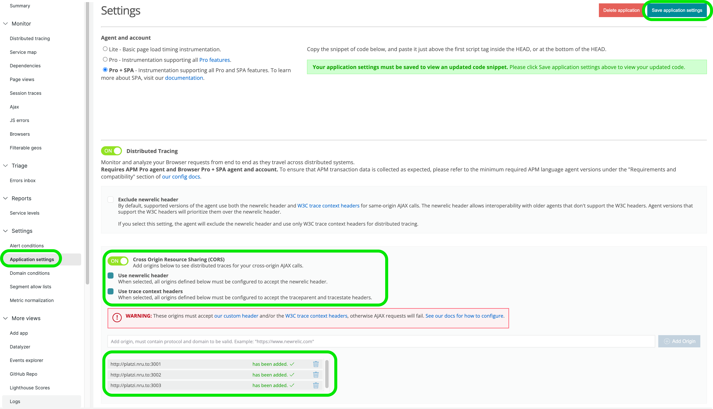

[](https://opensource.newrelic.com/oss-category/#new-relic-experimental)

# Relicstaurants Application

> The Relicstaurants repository has been created as a microservice architecture environment so that you can test New Relic observability on a lightweight project. You can copy or fork the repository, run it using Docker, and implement observability yourself. 

## Requirements
In order to spin up this application with Docker, you will need the following software:  

* A free account with [New Relic](https://newrelic.com)
* [Git](https://github.com/git-guides/install-git) - You can verify installation with `git –version`
* [Docker Desktop](https://www.docker.com/products/docker-desktop/) - You can verify installation with `docker run hello-world`

*Note: the above verification commands should be ran in Terminal on Mac or Command Prompt on Windows*

## Clone this repository
1. From a new Terminal or Command Prompt window, clone this repository using Git `git clone https://github.com/Bijesse/Relicstaurants-Docker`
2. Navigate into your new workspace using `cd Relicstaurants-Docker`

## New Relic APM instrumentation
This application is comprised of 3 microservices [restaurantService](restaurantService/newrelic.js), [menuService](menuService/newrelic.js), [checkoutService](checkoutService/newrelic.js). There is nothing you will need to do to instrument these services until you are ready to run the application.

## New Relic Browser instrumentation
The next New Relic agent to be added to this application is Browser. This will allow for you to have full stack observability and make use of the distributed tracing features of New Relic.

1. In your New Relic account, select **add data** and locate Browser for [React](https://one.newrelic.com/marketplace?account=3617221&duration=1800000&state=37da579a-b782-d2fb-6656-35acd0b868d0)
2. Select **Copy/Paste JavaScript Code**
3. Name your app as a standalone app called "r-frontend"
4. Click **enable**. You may ignore the HTML snippet that appears on screen for now and instead close the window. 
5. Navigate to the Browser Applications being observed in your New Relic account. You should see the service "r-frontend" listed there. Click on it.
6. Select "Application settings" view in the "Settings" section on the left *- see screenshot below*
7. Enable "Cross Origin Resource Sharing(CORS)", "Use newrelic header", "Use trace context headers" and add the backend origins ( http://platzi.nru.to:3001 http://platzi.nru.to:3002 http://platzi.nru.to:3003 ) to enable newrelic headers to be passed between the frontend app and the microservices instrumented with APM *- see screenshot below*
8. Click "Save application settings" *- see screenshot below*
9. This will redirect you to the main view of the browser app in New Relic. At this point, re-enter the "Application settings" view and copy the HTML snippet available in the first section. The snippet should be then pasted after the meta tag in the public > [index.html](public/index.html) file. 

 

## Docker Installation
At this point, you are ready to run your application in Docker.

1. Navigate to the root directory of your local repository in Terminal or Command Prompt.
2.  export your [New Relic ingest license key](https://docs.newrelic.com/docs/apis/intro-apis/new-relic-api-keys/#ingest-keys) using the command below. Note: be sure to update the command to include your ingest license key. 
```
export NEW_RELIC_API_KEY=<your_license_key>
```

3. Build and run the app using Docker:
```shell
docker-compose up
```

Make several orders in the Relicstaurants app running at [localhost:3000](localhost:3000) and check the pre-built dashboards for data being observed by New Relic.

## Simulate application traffic
This repository includes a simulator file that will make random orders on Relicstaurants so that you do not need to manually generate traffic. Run the simulator script with the following steps:

1. Open a new Terminal or Command Prompt window and navigate to the **simulator** directory 
2. Install the simulator dependencies using `pip3 install -r requirements.txt`
4. run `python3 simulator.py`

*Note: If you encounter any issues while on a Windows PC, try running this script in a administrator shell.* 

## Challenges
This application includes two bugs. Can you locate and resolve them using New Relic? 

* The first bug is related to slowness on the frontend of this application
* The 2nd bug is an error that commonly occurs. If you run `python3 simulator.py` from inside the simulator directory you should see this error occur after a few random tests are completed

## Contributing

We encourage your contributions to improve Relicstaurants! Keep in mind when you submit your pull request, you'll need to sign the CLA via the click-through using CLA-Assistant. You only have to sign the CLA one time per project.
If you have any questions, or to execute our corporate CLA, required if your contribution is on behalf of a company, please drop us an email at opensource@newrelic.com.

### **A note about vulnerabilities**

As noted in our [security policy](../../security/policy), New Relic is committed to the privacy and security of our customers and their data. We believe that providing coordinated disclosure by security researchers and engaging with the security community are important means to achieve our security goals.

If you believe you have found a security vulnerability in this project or any of New Relic's products or websites, we welcome and greatly appreciate you reporting it to New Relic through [HackerOne](https://hackerone.com/newrelic).

## License

The Relicstaurants app has been adapted from the Open source project [FoodMe](https://github.com/IgorMinar/foodme) 


Relicstaurants is licensed under the [Apache 2.0](http://apache.org/licenses/LICENSE-2.0.txt) License.

> Relicstaurants also uses source code from third-party libraries. You can find full details on which libraries are used and the terms under which they are licensed in the third-party notices document.
